# FinGuide - Think Smart Spend Smart
FinGuide is a personal finance management application designed to help users track income and expenses, understand spending patterns, and gain meaningful insights through analytics and AI-assisted suggestions.

The app focuses on clarity, visualization, and actionable insights, making personal finance easier to understand and manage.

## Project Goals
- Make financial data easy to understand
- Encourage better spending habits
- Provide data-driven insights, not just raw numbers
- Keep the system extensible for future features

## Features

### Dashboard Overview
- Displays total income and total expenses across all time
- Shows current month income and expenses separately for better budgeting
- Clean, modern UI with intuitive financial cards

### Expense Breakdown
- Category-wise expense distribution for the current month
- Interactive pie chart to visualize spending habits
- Helps users identify categories with the highest spending

### Income vs Expense Trend
- Bar chart comparing income and expenses over time
- Supports flexible date ranges (not limited to a single month)
- Useful for tracking trends and identifying overspending periods

### Recent Transactions
- Displays the most recent transactions at a glance
- Clearly differentiates income and expense entries
- Enables quick review of latest financial activity

### AI Insights
- Generates smart financial suggestions based on user spending data
- Users can provide preferences (e.g., “I want to reduce entertainment spending”)
- AI responses are structured and actionable

### Monthly Analytics
- Automatically detects the current month and year
- Calculates:
  - Monthly expense trend
  - Percentage change from the previous month
  - Weekday vs weekend spending behavior
  - Spending spikes and anomalies

### Currency Support
- Each user has an associated currency code
- Currency is displayed consistently across dashboard and analytics views


## Project Structure
```

├── backend/            # Flask API, Models, and Routes
├── frontend/           # Flutter Application
├── database/           # SQL Schemas and Migrations
└── README.md
```

## Architecture Overview
```
Flutter App
|
|── REST API Calls
↓
Flask Backend
|
|── Analytics Services
|── Transaction Services
|── AI Insight Generator
↓
PostgreSQL Database
```

## Analytics & Logic Highlights
- Date handling is month-aware and year-aware (no hardcoded inputs)
- Monthly analytics use:
  - First day of month → Last day of month
- Decimal-safe calculations to avoid floating-point inaccuracies
- Backend responses are JSON-structured and frontend-safe

## Tech Stack
* **Frontend:** Flutter (Mobile/Web)
* **Backend:** Flask (Python)
* **Database:** PostgreSQL
* **Authentication:** JWT (JSON Web Tokens)

## Getting Started

### Prerequisites
* [Flutter SDK](https://docs.flutter.dev/get-started/install)
* [Python 3.x](https://www.python.org/downloads/)
* [PostgreSQL](https://www.postgresql.org/download/)


### 1. Clone the Repository
```bash
git clone git@github.com:sudeepSubedi01/FinGuide-APIE-Advanced-Camp.git
cd FinGuide-APIE-Advanced-Camp
```
### 2. Backend Setup (Flask)
```bash
cd backend
# Create virtual environment
python3 -m venv venv
# Activate virtual environment
source venv/bin/activate    # Linux
venv\Scripts\activate       # Windows
# Install dependencies
pip install -r requirements.txt
```
<b>Environment Variables</b>: Create a `.env` file in the `/backend` directory:
```env
DATABASE_URL=postgresql+psycopg2://<username>:<password>@localhost:5432/finguide
JWT_SECRET_KEY=your_super_secret_key
GEMINI_API_KEY=your_key_here
```
<b>Database Initialization:</b>
```bash
# Ensure PostgreSQL is running and 'finguide' DB is created
flask db upgrade
# Or if using raw SQL:
psql -U <username> -d finguide -f database/schema.sql
```
<b>Run Server:</b>
```bash
flask run
```
Backend runs at: `http://localhost:5000`

### 3. Frontend Setup (Flutter)
Ensure your emulator is running or a device is connected.
```bash
# Navigate to /frontend folder
cd frontend
# Get dependencies
flutter pub get
# Run the flutter app
flutter run
```


## Future Enhancements
- Budget limits per category
- Savings goals and progress tracking
- Export reports (PDF / CSV)
- Multi-currency conversion
- Notifications for unusual spending

# App Screenshots
| Register| Login | Profile |
|----------|-------------------| ------ |
|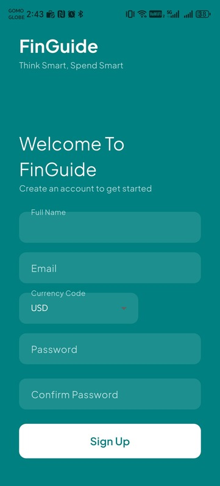| 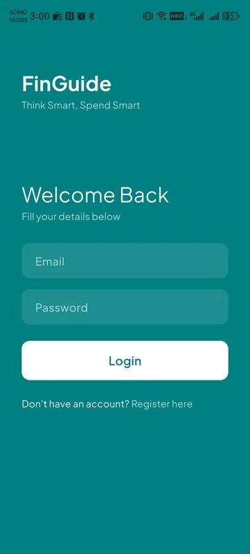 |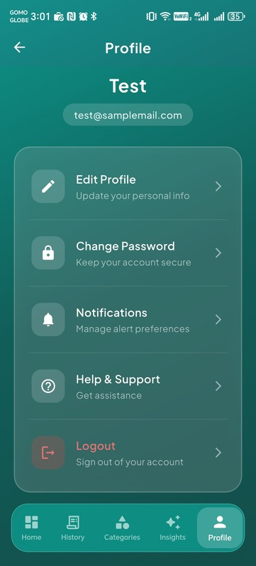 |

| Dashboard Screen| Dashboard Graphs | Transaction History |
|----------|-------------------| ------|
|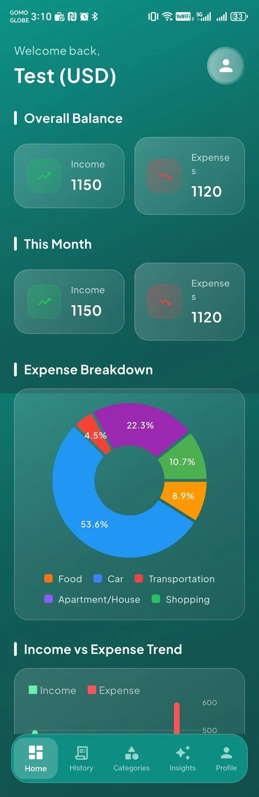| 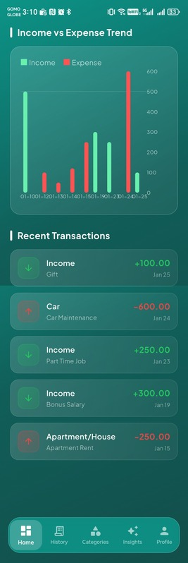 | 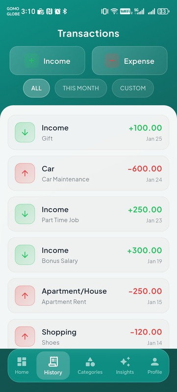 |

| Add Income | Add Expense | Categories List |
|----------|-------------------| ------|
|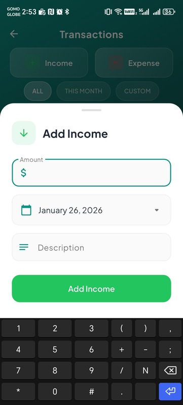|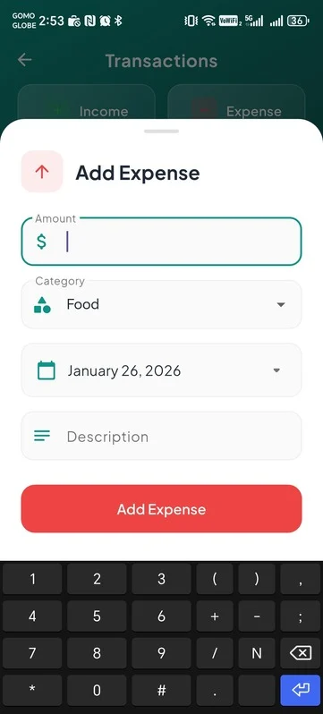| 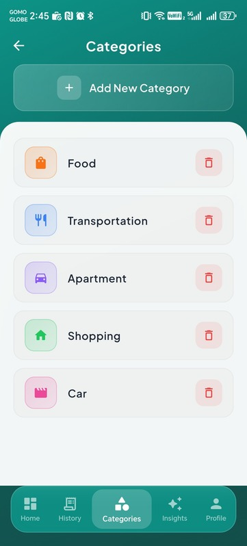

| Add Category | Insights | AI Insights |
|----------|-------------------| ------|
|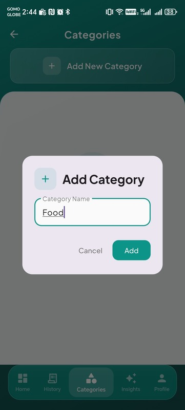|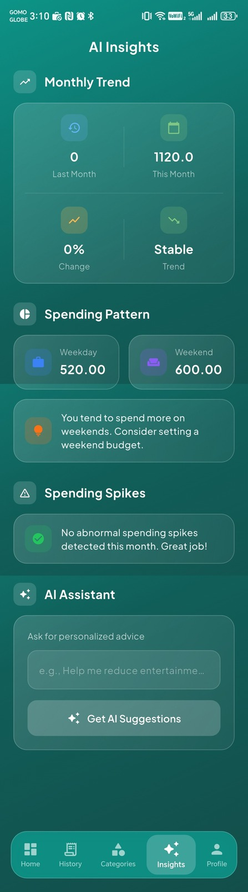| 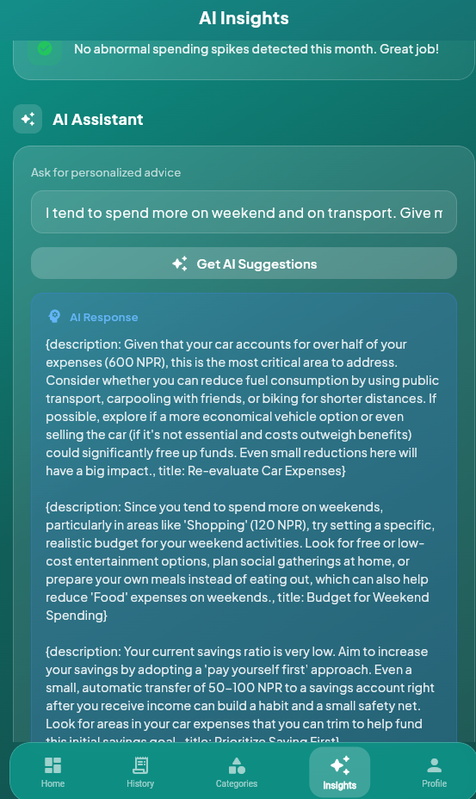|
